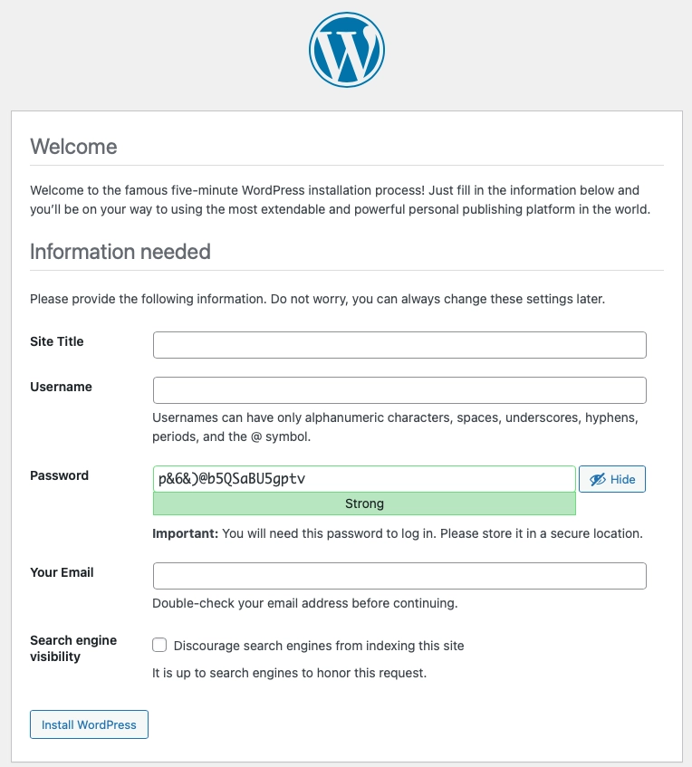

# Kubernetes WordPress Stack

Create a Kubernetes driven WordPress Stack with NGiNX, MariaDB, Composer, and WP-CLI using Ansible and Podman.


 
## Prerequisites

The following items are necessary for a successful deployment.

### Components

- `Podman Desktop` and `podman` CLI
- `Visual Studio Code`or equivilent code editor
- `docker.io`, `ghcr.io`, or `quay.io` ( RedHat ) to store images
- `Minikube` and 'kubernetes-cli'

### Variables

A hidden `.env` file with the following values:

``` Dotenv
DB_NAME=''
DB_USER=''
DB_PASSWORD=''
DB_ROOT_PASSWORD=''
DB_HOST=''
WP_ENV=''
WP_HOME='http://<site_url>'
WP_SITEURL='http://<site_url>/wp'

# Generate your keys here: https://roots.io/salts.html
AUTH_KEY=''
SECURE_AUTH_KEY=''
LOGGED_IN_KEY=''
NONCE_KEY=''
AUTH_SALT=''
SECURE_AUTH_SALT=''
LOGGED_IN_SALT=''
NONCE_SALT=''
```

### Ansible

An `~/inventory.yaml` file for Ansible to reference the hosts value.

``` yaml
---
apple:
  hosts:
    darwin:
      ansible_connection: local
...
```

A `main.yaml` file in the `ansible/defaults` subdirectory:

``` yaml
---
DB_ROOT_PASSWORD: Mariadb root password
DB_PASSWORD: Mariadb admin password
DB_NAME: Database name
DB_USER: Default database user
EMAIL: WordPress admin email
TITLE: WordPress site title
WP_USER: WordPress admin user
...
```

#### Additional variables needed for Podman image creation

``` yaml
---
FPM: PHP-FPM release version
COMPOSER: Composer release version
MARIADB: `[repo/username]/[imagename]:[version]` of the MariaDB image
NGiNX: `[repo/username]/[imagename]:[version]` of the NGiNX image
PHP: `[repo/username]/[imagename]:[version]` of the PHP image
SELF: Path to the local clone of the wordpress repository
...
```

## Podman

The NGiNX image can be built, tagged, and pushed to a repo for easy access.

``` zsh
podman build --file Containerfile --tag [name] .

podman image tag [name]:latest [repo]/[name]:[version]

podman push [repo]/[name]:[version]
```

Or, using Ansible to automate the process:

``` zsh
ansible-playbook podman.yaml -i ~/inventory.yaml
```

## Run

1. Start the Minikube environment:

``` zsh
> minikube start                                                                                 
😄  minikube v1.33.1 on Darwin 14.5
    ▪ MINIKUBE_IN_STYLE=1
    ▪ MINIKUBE_ROOTLESS=true
✨  Using the hyperkit driver based on user configuration
👍  Starting "minikube" primary control-plane node in "minikube" cluster
🔥  Creating hyperkit VM (CPUs=2, Memory=4000MB, Disk=20000MB) ...
🐳  Preparing Kubernetes v1.30.0 on Docker 26.0.2 ...
    ▪ Generating certificates and keys ...
    ▪ Booting up control plane ...
    ▪ Configuring RBAC rules ...
🔗  Configuring bridge CNI (Container Networking Interface) ...
🔎  Verifying Kubernetes components...
    ▪ Using image gcr.io/k8s-minikube/storage-provisioner:v5
🌟  Enabled addons: storage-provisioner, default-storageclass
🏄  Done! kubectl is now configured to use "minikube" cluster and "default" namespace by default
```

2. Create the Kubernetes deployments:

``` zsh
ansible-playbook playbook.yaml -i ~/inventory.yaml
```

3. Monitor the deployments using the Minikube Dashboard:

``` zsh
minikube dashboard
```

4. Create the Roots/Bedrock project:

``` zsh
ansible-playbook bedrock.yaml -i ~/inventory.yaml
```

5. Navigate to the locally hosted site:

``` zsh
minikube service nginx
```

You should be greeted by the WordPress install screen:



## Delete

To remove all deployments:

``` zsh
ansible-playbook delete.yaml -i ~/inventory.yaml
```

## License

Code is distributed under [The Unlicense](https://github.com/farghul/kuberpress/blob/main/LICENSE.md) and is part of the Public Domain.
